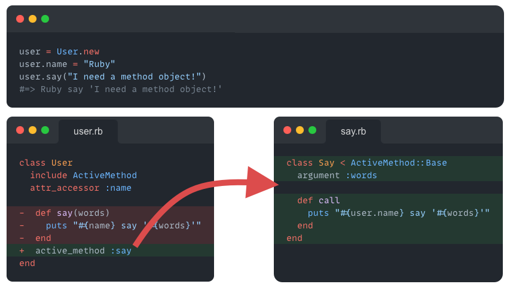

# ActiveMethod

Method is an object in Ruby, but we need **a real method object**. Welcome to `ActiveMethod`!

- **Clean scope** without module
- **High maintainability** with tiny method objects
- Make wrting OO **easy**, then writing OO **everywhere**



## Installation

```bash
$ bundle add active_method
```

## API

**It just do what a method do, and nothing else!**

### Define method object

```ruby
class User
  include ActiveMethod

  active_method :foo
  active_method :bar, MyBar
  active_method :build_one, class_method: true
end

module Util
  active_method :parse_url, module_function: true
end
```

### Declaring arguments

```ruby
class Foo < ActiveMethod::Base
  argument :a
  argument :b, default: 2
  keyword_argument :c
  keyword_argument :d, default: 4

  def call
    puts "a: #{a}, b: #{b}, c: #{c}, d: #{d}"
  end
end

User.new.foo('aa', 3, c: 'cc', d: 5)
#=> a: aa, b: 3, c: cc, d: 5
```

### Get the owner of the method

```ruby
class User
  include ActiveMethod
  attr_accessor :name
  attr_accessor :fromal_name
  active_method :hi
end

class Hi < ActiveMethod::Base
  def call
    puts "Hi, I'm a #{@__method_owner.fromal_name}. Please call me #{user.name}"
  end
end

user = User.new
user.name = 'ActiveMethod'
user.fromal_name = 'method object'
user.hi
#=> Hi, I'm a method objectc, please call me ActiveMethod
```

## Development

```bash
bundle install
meval rake # Run test
meval -a rake # Run tests against all Ruby versions and Rails versions
```

## Contributing

Bug reports and pull requests are welcome on GitHub at https://github.com/hoppergee/active_method. This project is intended to be a safe, welcoming space for collaboration, and contributors are expected to adhere to the [code of conduct](https://github.com/hoppergee/active_method/blob/master/CODE_OF_CONDUCT.md).

## License

The gem is available as open source under the terms of the [MIT License](https://opensource.org/licenses/MIT).

## Code of Conduct

Everyone interacting in the ActiveMethod project's codebases, issue trackers, chat rooms and mailing lists is expected to follow the [code of conduct](https://github.com/hoppergee/active_method/blob/master/CODE_OF_CONDUCT.md).
